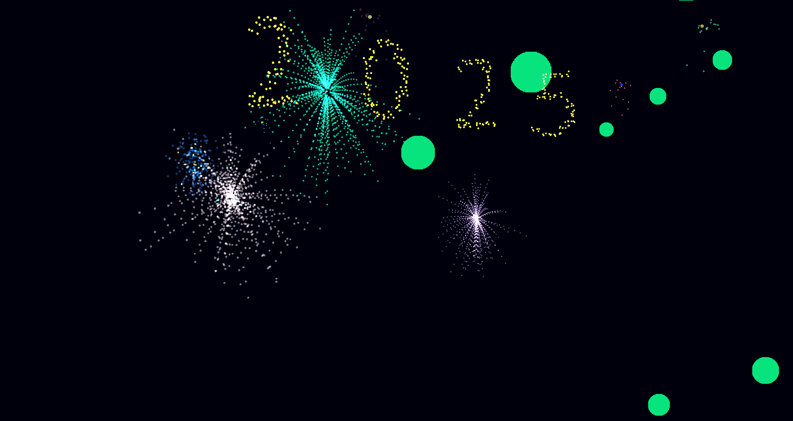
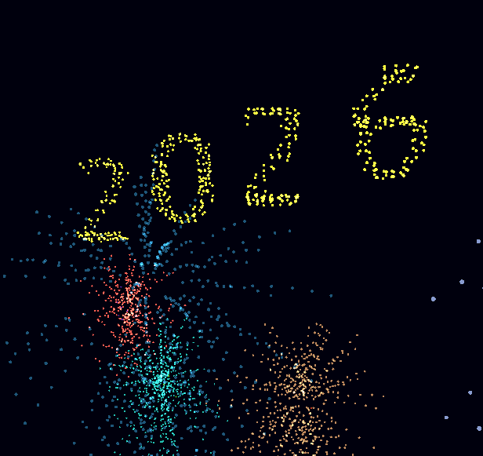
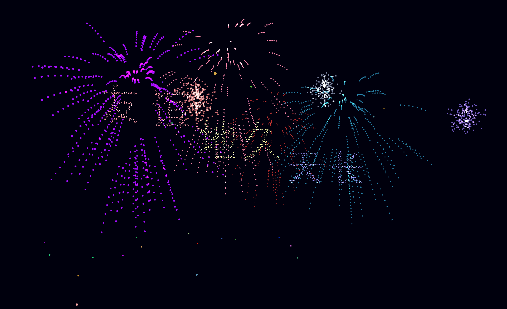
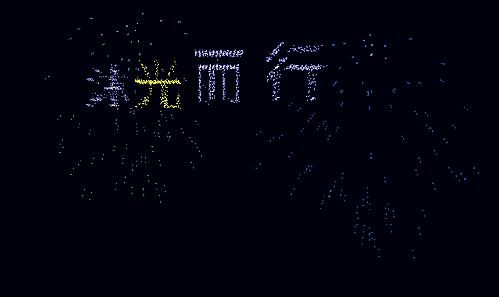

# Firework Show 2026

[](https://www.panda3d.org/)
[](https://opensource.org/licenses/MIT)

A spectacular 3D firework show powered by Panda3D, featuring script‑driven performances, real‑time particle effects, and interactive mode. Perfect for New Year celebrations, special events, or just for fun!

一个基于 Panda3D 的绚丽 3D 烟花秀程序，支持脚本驱动的表演、实时粒子特效和交互模式。适用于新年庆典、特殊活动或纯粹的娱乐！

---

## 📸 Screenshots / 截图








---

## 🌟 Features / 特性

- **Scripted Show** – Define firework performances via JSON scripts (time, position, color, explosion style, camera moves).  
  **脚本化表演** – 通过 JSON 脚本定义烟花表演（时间、位置、颜色、爆炸样式、摄像机运动）。

- **Advanced Particle System** – Each firework consists of thousands of particles with realistic physics (gravity, drag) and visual effects (trail, tail, flash).  
  **高级粒子系统** – 每朵烟花由数千粒子组成，具备真实物理（重力、阻力）和视觉效果（拖尾、尾焰、闪烁）。

- **Multiple Explosion Strategies** – Standard sphere, random colors, glitter bomb, heart shape, and **3D text shape** (displays any word as particles).  
  **多种爆炸策略** – 标准球形、随机颜色、闪光弹、心形，以及 **3D 文字形状**（将任意单词以粒子形式显示）。

- **Cinematic Camera** – Scriptable camera positions and look‑at points with smooth interpolation.  
  **电影级运镜** – 可脚本化的摄像机位置和注视点，并支持平滑插值。

- **Interactive Mode** – After the intro show, you can fire fireworks by clicking or pressing space. Use mouse to control the view.  
  **交互模式** – 开场秀结束后，你可以通过点击鼠标或按空格发射烟花，并用鼠标自由控制视角。

- **Audio & Music** – Launch/explosion sound effects and background music (loopable).  
  **音效与音乐** – 发射/爆炸音效和循环背景音乐。

- **Bloom Post‑processing** – Gorgeous glow effect for a dreamy atmosphere.  
  **泛光后期特效** – 绚丽的辉光效果，营造梦幻氛围。

---

## 🚀 Installation & Usage / 安装与运行

### Prerequisites / 前提条件

- Python 3.7+
- [Panda3D](https://www.panda3d.org/) (1.10.13 or later)  
  Install via pip:
  ```bash
  pip install panda3d
  ```

### Get the code / 获取代码

```bash
git clone https://github.com/yourname/firework-show-2026.git
cd firework-show-2026
```

### Resource files / 资源文件

Place the following assets in the corresponding directories (examples are provided in the repository):  
请将以下资源文件放入对应目录（仓库中已提供示例）：

- Audio: `assets/audio/launch.mp3`, `assets/audio/explosion.wav`, `assets/audio/bgm/bgm.mp3`
- Fonts: `assets/fonts/SourceHanSansSC-Normal.otf` (or any Chinese‑compatible font)
- Config: `config/config.json` (see [Configuration](#configuration))

### Run the show / 运行烟花秀

```bash
python main.py
```

- During the intro, press **Ctrl** to start/pause, **Enter** to skip to interactive mode.
- In interactive mode: click **left mouse** to launch a firework at the cursor, press **Space** for a random launch, press **R** to replay the intro.
- 开场秀期间：按 **Ctrl** 开始/暂停，按 **Enter** 跳过至交互模式。
- 交互模式中：点击**鼠标左键**在光标处发射烟花，按**空格键**随机发射，按 **R** 键重播开场秀。

---

## ⚙️ Configuration / 配置

The show is driven by `config/config.json`. The structure is as follows:  
表演由 `config/config.json` 驱动，结构如下：

```json
{
  "firework": [
    [ time_in_seconds, [ event1, event2, ... ] ],
    ...
  ],
  "camera": [
    { "time": t1, "pos": [x,y,z], "look_at": [x,y,z], "up": [0,0,1] },
    ...
  ]
}
```

### Firework Event / 烟花事件

Each event supports:
- `type`: `"launch_to"` (currently only type)
- `pos`: target position `[x, y, z]` (z is explosion height)
- `time`: flight duration in seconds (can be `{"min": a, "max": b}` for random range)
- `color`: `[r,g,b]` or `"random"`
- `size`: particle size scale
- `trace`: number of trail frames
- `tail`: tail effect config `{"count": rate_per_sec, "velocity": speed, "color": [r,g,b], "time": life_ms}`
- `strategy`: explosion pattern – `"standard"`, `"standard_rc"`, `"heart"`, `"glitter"`, or `{"name": "text_shape_3d", "args": ["WORD"]}`

Example:  
每个事件支持：
- `type`: 目前仅有 `"launch_to"`
- `pos`: 目标位置 `[x, y, z]`（z 为爆炸高度）
- `time`: 飞行时间（秒），可设为 `{"min": a, "max": b}` 随机范围
- `color`: `[r,g,b]` 或 `"random"`
- `size`: 粒子尺寸缩放
- `trace`: 拖尾帧数
- `tail`: 尾焰配置 `{"count": 每秒发射数, "velocity": 速度, "color": [r,g,b], "time": 寿命(毫秒)}`
- `strategy`: 爆炸样式 – `"standard"`、`"standard_rc"`、`"heart"`、`"glitter"`，或 `{"name": "text_shape_3d", "args": ["文字"]}`

### Text Shape Fireworks / 文字形状烟花

To display a word as fireworks, set `strategy` to:  
要显示文字烟花，设置 `strategy` 为：

```json
"strategy": {"name": "text_shape_3d", "args": ["你-我"]}
```

The program will automatically generate 3D point cloud for the text (requires the `text_manager` module, which is included).  
程序会自动生成文字的 3D 点云（需要 `text_manager` 模块，已包含）。

---

## 📦 Packaging / 打包

A standalone executable version is **coming soon**! You will be able to download a single file and run the show without Python.  
独立可执行版本**即将推出**！届时你可以下载单个文件，无需安装 Python 即可运行。

For now, you can package it yourself using [PyInstaller](https://pyinstaller.org/):  
目前你可以使用 [PyInstaller](https://pyinstaller.org/) 自行打包：

```bash
pip install pyinstaller
pyinstaller --onefile --add-data "assets;assets" --add-data "config;config" main.py
```

> Note: Adjust the paths according to your OS (use `:` for Linux/macOS).  
> 注意：根据操作系统调整路径分隔符（Linux/macOS 使用 `:`）。

---

## 🔜 Coming Soon / 即将推出

- More explosion strategies (rings, spirals, etc.)  
  更多爆炸样式（环形、螺旋等）
- Real‑time music synchronization  
  实时音乐同步
- Networked multi‑viewer support  
  网络多观众支持
- Pre‑compiled Windows/macOS/Linux binaries  
  预编译的 Windows/macOS/Linux 可执行文件

---

## 📄 License / 许可证

This project is licensed under the MIT License – see the [LICENSE](LICENSE) file for details.  
本项目采用 MIT 许可证，详情请见 [LICENSE](LICENSE) 文件。

---

## 🙏 Acknowledgements / 致谢

- [Panda3D](https://www.panda3d.org/) – the amazing 3D engine
- Font: [Source Han Sans](https://github.com/adobe-fonts/source-han-sans) by Adobe
- Sound effects from [Freesound](https://freesound.org/) (see `assets/audio/credits.txt`)

---

**Enjoy the show!**  
**祝观赏愉快！**